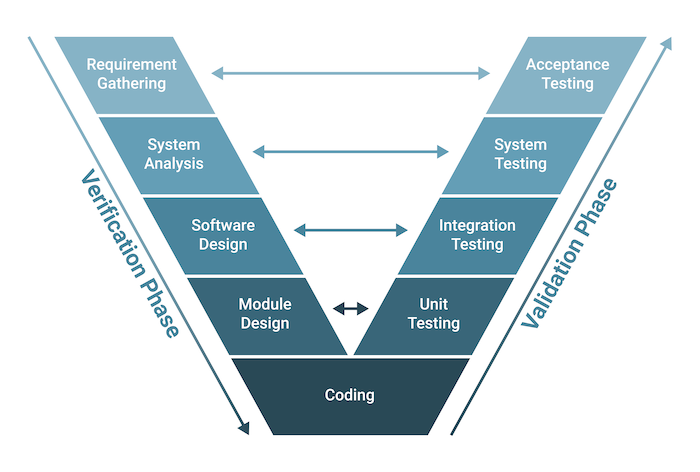

# 01 Introduction and Objectives for Test Automation – 45 minutes

## Keywords:
system under test, test automation, test automation engineer

## Learning Objectives for Chapter 1:
### 1.1 Purpose of Test Automation
- TAE-1.1.1 (K2) Explain the advantages and disadvantages of test automation
### 1.2 Test Automation in the Software Development Lifecycle
- TAE-1.2.1 (K2) Explain how test automation is applied across different software development lifecycle
models
- TAE-1.2.2 (K2) Select suitable test automation tools for a given system under test

## 1.1 Purpose of Test Automation
### 1.1.1 Explain the advantages and disadvantages of test automation

Test automation, which includes automated test execution and test reporting, is one or more of the following
activities:

-  Using purpose-built software tools to control and set up test suites for test execution
- Executing tests in an automated way
- Comparing actual results to expected results

Test automation provides significant features and capabilities that can interact with a system under test
(SUT). Test automation can cover a broad area of software. Solutions cover many kinds of software (e.g.,
SUT with a user interface (UI), SUT without a UI, mobile applications).

### Advantages
- Allows **more tests** to be run per build compared to manual tests
- Provides the ability to create and execute tests that cannot be executed manually (e.g., real-time response, remote testing, and parallel testing)
- Allows for tests that are **more complex** than manual tests
- Executes **faster** than manual tests
- Is **less subject to human error**
- Is more **effective and efficient** in use of test resources
- Provides **quicker feedback** regarding SUT quality
- Helps improve system reliability (e.g., availability and recoverability)
- Improves the **consistency** of test execution across test cycles

### Disadvantages:
- **Additional costs** may be involved for the project, such as hiring a Test Automation Engineer (TAE), buying new hardware, and setting up training
- Requires an **initial investment** to set up a test automation solution
- **Time for develop** and maintain a test automation solution
- **Clear objectives** are necessary to ensure success
- Tests may be rigid and **less adaptable** to changes in the SUT
- Test automation may introduce **additional defects - false negative bugs**

### Limitations to test automation:
- **Not all manual tests can be automated**
- Verifies only what automated tests are programmed to do
- Test automation can only check machine-interpretable test results, meaning some quality characteristics may not be testable with automation
- Test automation can only verify results that can be checked by an automated test oracle

## 1.2 Test Automation in the Software Development Lifecycle
### 1.2.1 Explain How Test Automation is Applied Across Different Software Development Lifecycle Models

#### Lifecycle Models:

- **Waterfall**
The waterfall model is an SDLC model that is both linear and sequential. This model has distinct phases
(i.e., requirements, design, implementation, verification, and maintenance) and each phase typically
concludes with documentation that must be approved. Implementation of test automation typically happens
in parallel to or after the implementation phase. Test runs usually take place during the verification phase
due to the software components not being ready for testing until then.

```
Requirements
          ↓
         Design
            ↓
           Implementation (Coding)
                    ↓
              Testing (Automated Testing)
                                      ↓
                                  Maintenance

```

- **V-model**
The V-model is an SDLC model where a process is executed in a sequential manner. As a project is defined
from high level requirements to low-level requirements, corresponding test and integration activities are
defined to validate those requirements. This is where the traditional test levels are derived from: component,
component integration, system, system integration, and acceptance.
Providing a test automation framework (TAF) for each test level is possible and recommended.



- **Agile software development**

In Agile software development, there are countless possibilities for test automation. Unlike the waterfall or
the V-model, in the Agile software development method, TAEs and business representatives can decide
on the roadmap, timeline and planned test delivery. In this method, there are best practices such as code
reviews, pair programming and frequent automated test execution. Eliminating silos (i.e., making sure that
developers, testers, and other stakeholders work together) allows teams to cover all test levels with the
appropriate amount and depth of test automation, achieving a goal called in-sprint automation.


### 1.2.2 Select Suitable Test Automation Tools For a Given System Under Test

To identify the most suitable test tools for a given project the **SUT must first be analyzed**. TAEs need to **identify the project requirements** that can be used as the baseline for tool selection.

Since different test automation tool features are used for UI software and, for example, web services, it is
**important to understand what the project wants** to achieve over time. There is no limit to the number of test
automation tools and features that can be used or selected, but the **costs must always be considered**. Using
a commercial off-the-shelf tool or implementing a custom solution based on open-source technology can
be a complex process.

The next topic to be evaluated is the **composition and experience of the team in test automation.** In the
case where the testers have little to no programming experience, using a low-code or no-code solution may
be a viable choice.

For technical testers with programming knowledge, it can be helpful to select tools whose language matches that of the SUT. This provides advantages including the ability to work with developers on debugging test automation defects more efficiently and cross training of members between teams.
