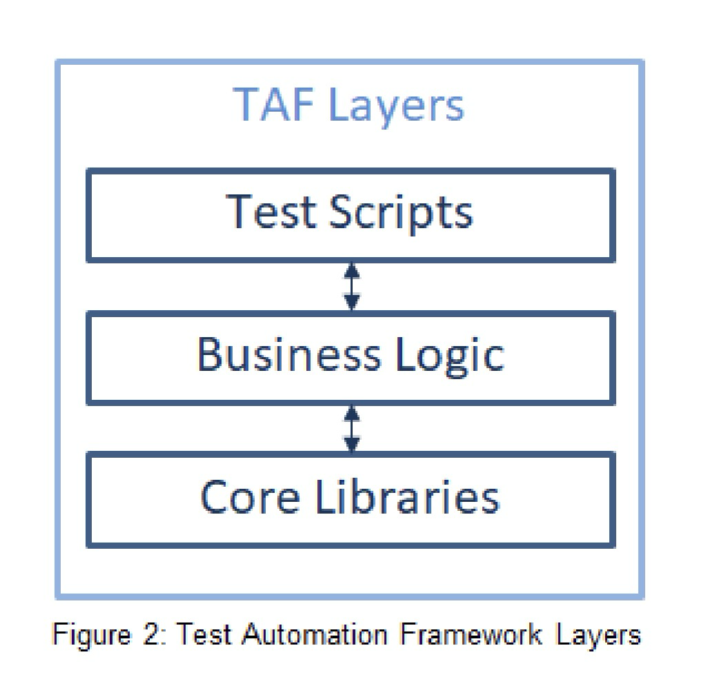

# 03  Test Automation Architecture – 210 min

## Keywords:
behavior-driven development, capture/playback, data-driven testing, generic test automation architecture,
keyword-driven testing, linear scripting, model-based testing, structured scripting, test adaptation layer,
test automation framework, test automation solution, test harness, test script, testware, test step, testdriven development

## Learning Objectives for Chapter 3:
### 3.1 Design Concepts Leveraged in Test Automation
- TAE-3.1.1 (K2) Explain the major capabilities in a test automation architecture
- TAE-3.1.2 (K2) Explain how to design a test automation solution
- TAE-3.1.3 (K3) Apply layering of test automation frameworks
- TAE-3.1.4 (K3) Apply different approaches for automating test cases
- TAE-3.1.5 (K3) Apply design principles and design patterns in test automation


## 3.1 Design Concepts Leveraged in Test Automation
### 3.1.1 Explain the major capabilities in a test automation architecture

### Generic Test Automation Architecture (gTAA):
The gTAA is a high-level design concept that offers an abstract view of **how test automation communicates with systems that test automation is connected**, such as the SUT, project management, test management, and configuration management (see figure 1). It outlines the essential **capabilities** needed when designing a test automation architecture (TAA).

#### The gTAA interfaces include:

- **SUT interface:** Connects the SUT with the test automation framework (TAF).
- **Project management interface:** Tracks the progress of test automation development.
- **Test management interface:** Maps test case definitions to automated test cases.
- **Configuration management interface:** Describes CI/CD pipelines, environments, and testware.


#### Capabilities provided by test automation tools and libraries
Core test automation capabilities should be selected based on project needs, including:

- **Test generation:** Automates the design of test cases using a test model. Model-based testing tools can assist in this process. This is an optional capability.
- **Test definition:** Facilitates defining and implementing test cases or suites, potentially derived from a test model. It separates test definitions from the SUT and test tools, supporting both high- and low-level tests via test data, test cases, and test libraries.
- **Test execution:** Automates the execution of tests and logging. It includes a tool to run selected tests and components for logging and reporting results.
- **Test adaptation:** Enables adapting automated tests to various SUT components or interfaces through adaptors for APIs, protocols, and services.

### 3.1.2 Explain how to design a test automation solution
A Test Automation Solution (TAS) is defined by an understanding of functional, non-functional, and
technical requirements of the SUT, existing or required tools that are necessary to implement a solution.

A TAS is implemented with commercial or open-source tools and may need additional SUT-specific adaptors.
The TAA defines the technical design for the overall TAS. It should address:
- Selecting test automation tools and tool specific libraries
- Developing plugins and/or components
- Identifying connectivity and interface requirements (e.g., firewalls, database, uniform resource locators (URLs)/connections, mocks/stubs, message queues, and protocols)
- Connecting to the test management and defect management tools
- Utilizing a version control system and repositories
### 3.1.3 Apply layering of test automation frameworks



#### Test Automation Framework
The TAF is the foundation of a TAS. It
often includes a test harness, also known
as test runner, and test libraries, test
scripts and test suites.
#### TAF Layers
TAF layers define a distinct border of
classes that have similar purposes such
as test cases, test reporting, test logging,
encryption, and test harnesses. By
introducing a layer for each single
purpose, the design can become
complicated. Therefore, it is
recommended to keep the number of
TAF layers low.
#### Test scripts
Its purpose is to provide a test case
repository of the SUT and test suite
annotations. It calls the services of the
business logic layer which may involve test steps, user flows, or API calls. However, no direct calls should
be made to the core libraries from test scripts.
#### Business logic
All the SUT dependent libraries are stored in this layer. These libraries will inherit the class files of the
core libraries or use the facades provided by them.
The business logic layer is used to set up the TAF to run against the SUT and the additional
configurations.
#### Core libraries
All the libraries that are independent of any SUT are stored in this layer. These core libraries can be
reused in any type of project that shares the same development stack.

### Scaling test automation

The above example (figure 3) shows how the core libraries provide a reusable base for multiple TAFs.
In Project #1 there are two TAFs built on top of the core libraries, and a separate project leverages the
already existing core libraries to build their TAF for testing App #3. One TAE builds the TAFs for Project
#1, while a second TAE builds the TAF for Project #2.

### 3.1.4 Apply different approaches for automating test cases
There are several **development approaches** that teams can choose from to produce automated test
cases. These can include interactive scripting languages or compiled programming languages. The
**different approaches provide different benefits** of automation and can be leveraged in different
circumstances. Although test-driven development (TDD) and behavior-driven development (BDD) are
development methodologies, if followed correctly, they result in automated test case development.

#### 1. Capture/playback
Capture/playback is an approach that captures interactions with the SUT while a sequence of actions is
performed manually. These tools produce test scripts during the capturing, and depending on the tool
used, test automation code may be modifiable. The tools that do not expose code are sometimes referred
to as no-code test automation, while the tools exposing code are referred to as low-code test automation.

**Pros**

-  Initially easy to set up and use

**Cons**
-  Hard to maintain, scale and evolve
The SUT needs to be available while capturing a test case
-  Only feasible for a small scope and an SUT that rarely changes
-  The captured SUT execution depends highly on the SUT version from which the capture has
been taken
-  Recording each individual test case instead of reusing existing building blocks is time consuming

**Example***
1. A tester manually interacts with the e-commerce website using the capture tool (e.g., Selenium IDE, Katalon Studio, or Ranorex Recorder).
2. The tool records user interactions like clicking the "Add to Cart" button, filling out registration forms, and completing checkout.
3. The recorded steps are saved as automated test scripts.

#### 2. Linear scripting

Linear scripting is a programming activity that does not require custom test libraries made by a TAE and
is used for writing and executing the test scripts. A TAE can leverage any test scripts that are recorded by
a capture/playback tool, which then can be modified.

**Pros**
- Easy to set up and to start writing test scripts
- Compared to capture/playback, the test scripts can be modified more easily

**Cons**
- Hard to maintain, scale and evolve
- The SUT needs to be available while capturing a test case
- Only feasible for a small scope and an SUT that rarely changes
- Compared to capture/playback, some programming knowledge is necessary

**Example***

- The tester records basic workflows like logging into the banking app, transferring money between accounts, and viewing statements using a capture/playback tool (e.g., Katalon Studio or Selenium IDE).
- The tester modifies the generated test scripts by editing the code directly to improve test flexibility and add verification steps.
- These scripts are executed as part of the testing process whenever the banking app is updated.

#### 3. Structured scripting
Test libraries are introduced with reusable elements, test steps and/or user journeys. Programming
knowledge is necessary for the creation and maintenance of test scripts in this approach.
**Pros**
- Easy to maintain, scale, port, adapt and evolve
- Business logic can be separated from the test scripts

**Cons**
- Programming knowledge is necessary
- Initial investment into TAF development and defining the testware is time consuming

**Example***
- The team creates reusable test libraries that represent common actions (e.g., logging in, searching for flights, selecting a hotel) and user journeys (e.g., booking a flight with a hotel package).
- These libraries are reused across different test scripts to avoid repetition and improve maintainability.
- Test scripts focus on higher-level business logic (e.g., validating booking confirmation), while the lower-level actions (e.g., clicking buttons, filling forms) are abstracted into reusable functions.

#### Test-driven development (TDD)
Test cases are defined as part of the development process before a new feature of the SUT is
implemented. The TDD approach is test, code, and refactor or otherwise known as red, green, and
refactor. A developer identifies and creates one test case that will fail (red). Then he/she develops
functionality that will satisfy the test case (green). The code is then refactored to optimize it and to abide
by clean code principles. The process continues with the next test and next increment of functionality.

**Pros**
- Simplifies component level test case development
- Improves code quality and the structure of the code
- Improves testability
- Makes it easier to achieve a desired code coverage
- Reduces defect propagation to higher test levels
- Improves communication between developers, business representatives and testers
- User stories that are not verified using GUI testing and API testing can quickly achieve exit
criteria by following TDD

**Cons**
- Initially takes more time to get accustomed to TDD
- Not following TDD properly can result in false confidence in code quality

**Example***

- Write a test first (Red):
The developer writes a unit test for a function that transfers funds between two accounts, expecting it to fail since the feature hasn't been implemented yet.

- Develop functionality to pass the test (Green):
The developer implements the `transfer_funds` function to satisfy the test case.

- The developer refactors the code to make it cleaner and more maintainable, without changing the functionality.


#### Data-driven testing (DDT)
builds upon the structured scripting approach. The test scripts are provided
with test data (e.g., .csv files, .xlsx files, and database dumps). This allows for running the same test
scripts multiple times with different test data.

**Pros**
- Enables quick and easy test case expansion through data feeds.
- Reduces the cost of adding new automated tests.
- Allows test analysts to specify automated tests by populating test data files, reducing dependency on technical test analysts.

**Cons**
- Proper test data management may be necessary

**Example***

- Test Script:
The test script is written to validate the loan application process, such as checking whether a user qualifies for a loan based on the data provided.

- Test Data Source:
A .csv file is prepared containing different sets of test data (e.g., income, loan amounts, credit scores) that will be fed into the script.

```csv
name,income,loan_amount,credit_score,expected_status
John Doe,60000,10000,720,Approved
Jane Smith,45000,20000,680,Rejected
Bob Johnson,80000,15000,750,Approved
```
- Executing Tests with Different Data:
The test script is executed in a loop, feeding each row from the .csv file into the script, allowing the same test logic to run with different inputs.

#### Keyword-driven testing (KDT)
involves creating test cases as a list or table of test steps based on keywords and corresponding test data. The keywords are user-oriented and often build on data-driven testing (DDT).

**Pros:**

- Test analysts and business analysts can help create automated test cases using the KDT approach.
- KDT can be applied to manual testing independently of automation (see ISO/IEC/IEEE 29119-5 Standard).

**Cons:**
- Implementing and maintaining keywords is complex, requiring significant effort from TAEs, especially as the scope expands.
- It can demand huge effort for smaller systems.

**Example***

1. **Define Keywords:**
   The team defines a set of keywords that represent actions in the checkout process, such as `AddToCart`, `EnterShippingInfo`, and `ConfirmOrder`. Each keyword corresponds to a function that performs the associated action.

    | Keyword               | Description                     |
    |-----------------------|---------------------------------|
    | `AddToCart`           | Adds a specified product to the cart. |
    | `EnterShippingInfo`   | Inputs user shipping details.   |
    | `ConfirmOrder`        | Submits the order for processing. |

2. **Create Test Cases:**
   Test analysts create test cases using these keywords and provide the necessary test data in a structured format (e.g., a table or spreadsheet).

    | Test Case | Keyword               | Test Data                  |
    |-----------|-----------------------|----------------------------|
    | TC1       | `AddToCart`           | ProductID: 12345          |
    | TC2       | `EnterShippingInfo`   | Name: John Doe, Address: 123 Main St |
    | TC3       | `ConfirmOrder`        | -                          |

3. **Execute Test Cases:**
   A test execution engine reads the keywords and corresponding test data, executing the defined functions in the specified order.

#### Behavior-Driven Development (BDD)
uses a natural language format (i.e., given, when, and then) to formulate acceptance criteria, which can be automated as test cases and stored in feature files. A BDD tool can then interpret this language and execute the tests.

**Pros:**

- Enhances communication between developers, business representatives, and testers.
- Automated BDD scenarios serve as test cases, ensuring coverage of specifications.
- BDD can support various test types at different levels of the test pyramid.

**Cons:**

- Additional test cases, particularly negative conditions and edge cases, still need to be defined by the team, often by a test analyst or TAE.
- Teams sometimes mistakenly view BDD as merely a way to write test cases in natural language, neglecting the involvement of business representatives and developers.
- Maintaining natural language test steps can be complex for TAEs.
- Overly complex test steps can complicate debugging, making it a difficult and costly process.

**Example***

**Context:**
A team is developing an online movie ticket booking system. They decide to use **Behavior-Driven Development (BDD)** to enhance collaboration among developers, business representatives, and testers. BDD allows them to formulate acceptance criteria in a natural language format using the "Given, When, Then" structure.

### BDD Process:

1. **Define Scenarios:**
   The team writes feature files containing scenarios that describe how users interact with the booking system. Each scenario uses the BDD format.

    ```gherkin
    Feature: Movie Ticket Booking

      Scenario: Successful Ticket Booking
        Given a user is on the movie selection page
        When the user selects a movie and clicks "Book Now"
        Then the user should be taken to the payment page

      Scenario: Insufficient Funds
        Given a user is on the payment page
        When the user enters credit card details with insufficient funds
        Then an error message should be displayed
    ```

2. **Implement Step Definitions:**
   The team creates step definitions that connect the natural language steps in the scenarios to the actual code.

    ```python
    from behave import given, when, then

    @given('a user is on the movie selection page')
    def step_impl(context):
        context.browser.go_to_movie_selection()

    @when('the user selects a movie and clicks "Book Now"')
    def step_impl(context):
        context.browser.select_movie("Inception")
        context.browser.click_book_now()

    @then('the user should be taken to the payment page')
    def step_impl(context):
        assert context.browser.current_page == "Payment Page"
    ```

### 3.1.5 Apply design principles and design patterns in test automation

Test automation is a software development activity. Therefore, design principles and design patterns are
just as important for a TAE as for a software developer.

#### Object-Oriented Programming Principles

The four major principles are:

**1. Encapsulation:** Bundles data and methods that operate on the data, restricting access to some components.

**2. Abstraction:** Simplifies complex reality by modeling classes based on essential properties and behaviors.

**3. Inheritance:** Allows one class to inherit the properties and methods of another, promoting code reuse.

**4. Polymorphism:** Enables objects to be treated as instances of their parent class, allowing for flexible and interchangeable code.


#### SOLID Principles
These five principles improve code readability, maintainability, and scalability:

**- Single Responsibility:** A class should have one reason to change.

**- Open-Closed:** Software entities should be open for extension but closed for modification.

**- Liskov Substitution:** Subtypes must be substitutable for their base types without altering the desired behavior.

**- Interface Segregation:** Clients should not be forced to depend on interfaces they do not use.

**- Dependency Inversion:** High-level modules should not depend on low-level modules; both should depend on abstractions.

#### Design Patterns for TAEs

**- Facade Pattern:** Hides implementation details, exposing only what testers need to create test cases.

**- Singleton Pattern:** Ensures a single instance of a driver communicates with the SUT.

**- Page Object Model:** Creates a class file referred to as a page model. When the SUT’s structure changes, updates are made in one place (the page model) rather than in every test case.

**- Flow Model Pattern:** Expands the page object model by adding an additional facade over page object models. It stores user actions that interact with page objects, enhancing abstraction and maintainability by allowing test steps to be reused across multiple test scripts.
