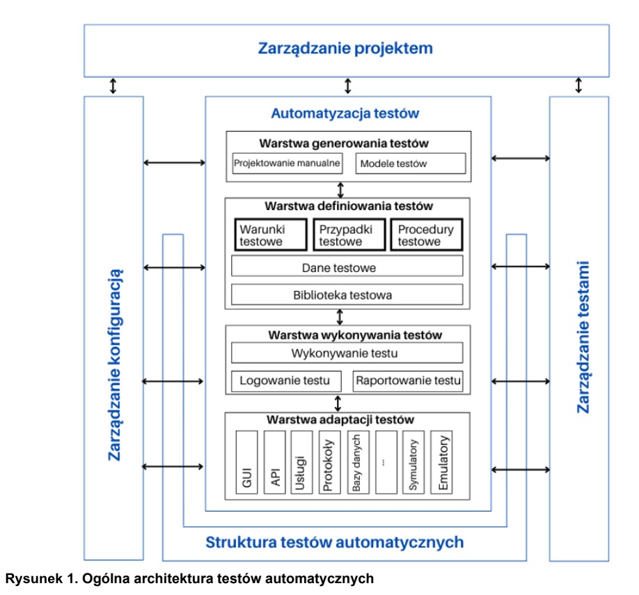

## 03. Ogólna architektura testów automatycznych gTTA - 270m

#### Słowa kluczowe:

podejście „rejestrowanie/odtwarzanie", testowanie sterowane danymi, ogólna architektura testów
automatycznych, testowanie oparte na słowach kluczowych, technika skryptów liniowych, testowanie oparte na modelu, technika skryptów sterowanych przez proces, technika skryptów ustrukturalizowanych, warstwa adaptacji testów, architektura testów automatycznych, struktura do testów automatycznych, rozwiązanie dla testów automatycznych, warstwa definicji testów, warstwa wykonywania testów, warstwa generowania testów

### 3.1 Wprowadzenie do ogólnej architektury testów automatycznych (gTAA)
#### Struktura Ogólnej Architektury Testów Automatycznych (gTAA)

# Struktura Ogólnej Architektury Testów Automatycznych (gTAA)

Rolą inżyniera automatyzacji testów jest projektowanie, rozwijanie, implementowanie i utrzymanie rozwiązań dla testów automatycznych (TAS). Podczas opracowywania każdego rozwiązania należy wykonywać podobne zadania, rozwiązywać podobne zagadnienia i spriorytetyzować je. Te powtarzające się kroki i podejścia są podstawą do opracowania ogólnej architektury testów automatycznych (gTAA).

gTAA przedstawia warstwy, komponenty i interfejsy, które są redefiniowane w celu stworzenia konkretnej architektury automatyzacji testów (TAA). Architektura taka pozwala zbudować rozwiązanie w sposób ustrukturyzowany i modułowy poprzez:
- Definiowanie pojęć, warstw, usług i interfejsów TAS w celu realizacji rozwiązań w oparciu o komponenty własne i zewnętrzne.
- Zapewnienie komponentów umożliwiających skuteczne tworzenie mechanizmów automatyzacji testów.
- Ponowne wykorzystanie komponentów do tworzenia lub rozwijania TAS dla różnych produktów i technologii.
- Ułatwienie pielęgnacji i rozwoju TAS.
- Definiowanie podstawowych funkcji dla użytkownika TAS.

Do realizacji TAS można wykorzystać strukturę do testów automatycznych (TAF), która ułatwia stworzenie środowiska testowego oraz zapewnia niezbędne narzędzia, jarzma testowe i biblioteki pomocnicze.

#### Kluczowe Zasady Architektury Testów Automatycznych (TAA)

- **Pojedyncza odpowiedzialność**:
  - Każdy komponent TAS musi realizować jeden cel, np. generowanie danych, tworzenie scenariuszy testowych, wykonywanie testów, rejestrowanie wyników.

- **Rozszerzalność**:
  - Każdy komponent musi być otwarty na rozszerzenia, ale zamknięty na modyfikacje, aby nie wpływać na kompatybilność wsteczną.

- **Zastępowalność**:
  - Musi istnieć możliwość wymiany każdego komponentu bez wpływu na ogólne zachowanie TAS.

- **Segregacja komponentów**:
  - Zastosowanie kilku komponentów specjalizowanych jest lepsze niż jednego wielofunkcyjnego, co ułatwia wymianę i utrzymanie komponentów.

- **Odwracanie zależności**:
  - Działanie komponentów TAS musi opierać się na abstrakcjach, a nie na szczegółach niskiego poziomu.

#### Narzędzia i Komponenty

Rozwiązanie dla testów automatycznych oparte na gTAA jest zwykle implementowane przy użyciu zbioru narzędzi (wraz z wtyczkami) i/lub komponentów. gTAA jest neutralna dla dostawcy, co oznacza, że można ją zaimplementować przy użyciu dowolnych metod, technologii i narzędzi programistycznych. W praktyce rozwiązania do automatyzacji testów często wdraża się z wykorzystaniem gotowych narzędzi, choć konieczne jest dodanie określonych funkcji i/lub dostosowanie narzędzi do potrzeb systemu podlegającego testowaniu.

Wytyczne i modele wzorcowe związane z tworzeniem rozwiązań do automatyzacji testów obejmują standardy inżynierii oprogramowania dotyczące cyklu wytwarzania oprogramowania (SDLC), technologie programowania, standardy formatowania itd. Inżynier automatyzacji testów powinien posiadać umiejętności, doświadczenie i specjalistyczną wiedzę w tej dziedzinie.

TAE musi znać standardy branżowe i najlepsze praktyki dotyczące tworzenia kodu i dokumentacji oraz korzystać z nich podczas tworzenia TAS, co zwiększa utrzymywalność, niezawodność i zabezpieczenia tego rozwiązania. Przykładowe standardy to:
- standard MISRA dotyczący języków C i C++,
- standard JSF dotyczący tworzenia kodu w języku C++,
- reguły AUTOSAR dotyczące środowiska MathWorks Matlab/Simulink®.

**3.1.1 (K2) Kandydat potrafi objaśnić strukturę ogólnej architektury testów automatycznych (gTAA).**

#### Struktura Ogólnej Architektury Testów Automatycznych (gTAA)

Ogólna architektura testów automatycznych (gTAA) składa się z kilku warstw:
- **Generowanie testów**: Umożliwia manualne lub automatyczne projektowanie przypadków testowych.
- **Definiowanie testów**: Pozwala definiować i implementować zestawy testowe i przypadki testowe, oddzielając ten proces od technologii i narzędzi systemu testowanego.
- **Wykonywanie testów**: Wspomaga wykonywanie testów i logowanie ich wyników, udostępniając narzędzie do automatycznego wykonywania testów oraz komponent rejestrująco-raportujący.
- **Adaptacja testów**: Dostosowuje testy automatyczne do potrzeb komponentów lub interfejsów systemu testowanego, oferując adaptery do łączenia się z SUT przez API, protokoły, usługi itd.

#### Interfejsy w gTAA

Interfejsy do zarządzania projektami, konfiguracją i testami wspierają automatyzację testów. Na przykład, interfejs między zarządzaniem testami a warstwą adaptacji testów odpowiada za wybór i konfigurację odpowiednich adapterów.

#### Zastosowanie Warstw

- **Automatyzacja wykonywania testów**: Wymaga warstwy wykonywania testów i adaptacji testów, które mogą być zrealizowane razem.
- **Automatyzacja definiowania testów**: Wymaga warstwy definiowania testów.
- **Automatyzacja generowania testów**: Wymaga warstwy generowania testów.

#### Implementacja TAS

Implementacja TAS najczęściej przebiega od dołu do góry, ale inne podejścia, jak automatyczne generowanie testów dla testów manualnych, mogą być użyteczne. Zaleca się metodę przyrostową, np. w formie sprintów, oraz fazę weryfikacji koncepcji (proof of concept).

Każdy projekt automatyzacji testów powinien być zarządzany jak projekt rozwoju oprogramowania, z dedykowanym zarządzaniem projektem. Można oddzielić zarządzanie projektem rozwoju TAF (automatyzacja testów na poziomie przedsiębiorstwa) od zarządzania projektem TAS (automatyzacja testów na poziomie konkretnego produktu).

#### 3.1.2 Warstwa generowania testów
Warstwa ta zawiera narzędzia do:
- Manualnego projektowania przypadków testowych.
- Opracowywania, rejestrowania i wyprowadzania danych testowych.
- Automatycznego generowania przypadków testowych na podstawie modeli systemu i jego środowiska.

Komponenty tej warstwy umożliwiają:
- Edytowanie i poruszanie się po strukturach zestawów testowych.
- Tworzenie powiązań między przypadkami testowymi a celami testów lub wymaganiami systemu.
- Dokumentowanie projektu testów.

#### 3.1.3 Warstwa definiowania testów
Warstwa ta zawiera narzędzia do:
- Określania przypadków testowych (wysokiego i niskiego poziomu).
- Definiowania danych testowych.
- Określania procedur testowych.
- Definiowania skryptów testowych.
- Dostępu do bibliotek testowych.

Komponenty tej warstwy umożliwiają:
- Parametryzowanie lub tworzenie instancji danych testowych.
- Określenie sekwencji testowych.
- Dokumentowanie danych testowych, przypadków testowych i procedur testowych.

#### 3.1.4 Warstwa wykonywania testów
Warstwa ta zawiera narzędzia do:
- Automatycznego wykonywania przypadków testowych.
- Logowania wykonywania testów.
- Raportowania rezultatów testów.

Komponenty tej warstwy umożliwiają:
- Konfigurację i demontaż SUT do testów.
- Konfigurację zestawów testowych.
- Parametryzowanie konfiguracji testowej.
- Przekształcanie danych testowych i przypadków testowych w skrypty wykonywalne.
- Logowanie i wstrzykiwanie błędów.
- Analizowanie odpowiedzi systemu podczas testów.
- Walidację odpowiedzi systemu.

#### 3.1.5 Warstwa adaptacji testów
Warstwa ta zawiera narzędzia do:
- Sterowania jarzmem testowym.
- Interakcji z systemem podlegającym testowaniu.
- Monitorowania systemu podlegającego testowaniu.
- Symulacji lub emulacji środowiska systemu podlegającego testowaniu.

#### 3.1.6 Zarządzanie konfiguracją TAS
Zarządzanie konfiguracją TAS obejmuje:
- Modele testów.
- Definicje/specyfikacje testów.
- Skrypty testowe.
- Narzędzia i komponenty uzupełniające.
- Adaptery testowe.
- Symulatory i emulatory.
- Rezultaty testów i raporty.

#### 3.1.7 Zarządzanie projektem w zakresie TAS
Każdy projekt automatyzacji testów jest projektem programistycznym i należy nim zarządzać zgodnie z cyklem wytwarzania oprogramowania (SDLC). Inżynier automatyzacji testów musi pozyskiwać informacje o statusie i raportować je kierownictwu.

#### 3.1.8 Obsługa zarządzania testami na poziomie TAS
TAS musi wspierać zarządzanie testami systemu podlegającego testowaniu. Raporty z testów muszą być łatwo dostępne i automatycznie dostarczane do kierownictwa testów.

### 3.2 Projektowanie architektury automatyzacji testów (TAA)

**3.2.1 (K4) Kandydat potrafi zaprojektować odpowiednią architekturę automatyzacji testów (TAA) na potrzeby danego projektu.**

